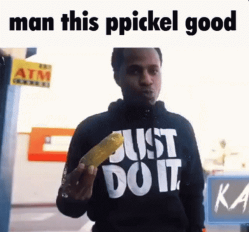

# Yo
I am Maxim Dolgov, 18 years old, interested in cybersecurity, reverse engineering, malware analysis, game modding/hacking, and cats

## Languages
- Rust
- C
- Some x86/x64 NASM
- Lua
- Javascript/Typescript
- Python

## Strengths
- Low Level Development
- Reverse Engineering
- Backend Development
- Game Hacking/Modding
- Sending Cat Pictures

## Contact and Links
- [mdolgov2007@gmail.com](mailto:mdolgov2007@gmail.com)
- [LinkedIn](https://www.linkedin.com/in/maxim-d-0a2730280/)
- [Blog](https://jollycistaken.github.io)
- jollyc on Discord

## Stats
  

